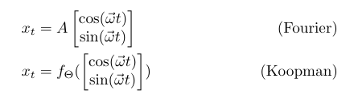

======
From Fourier to Koopman: Spectral methods for long-term forecasts
======

Fourier and Koopman constitute spectral algorithms for learning linear and non-linear oscillators from data respectively.
Both algorithms solve a global optimization problem in frequency domain and allow for modeling of systems of any dimensionality.
The algorithms are written in *numpy* and *pytorch*.

The objective of the algorithms is, respectively:

This code accompanies the following `paper <https://arxiv.org/abs/xxx.xxxx>`_. 

-----------------
How to use Fourier
-----------------

Fourier fits a linear oscillator to data. The number of frequencies *k* that the signal is assumed to exhibit and a learning rate needs to be specified. It is recommended to whiten the signal (zero-mean and unit-variance).

To learn the oscillator from data, do:

.. code:: python

    from fourier_koopman import fourier
    import numpy as np

    x = (np.sin([2*np.pi/24*np.arange(5000)]) + np.sin([2*np.pi/33*np.arange(5000)])).T
    x = x.astype(np.float32)

    f = fourier(num_freqs=2)
    f.fit(x[:3500], iterations = 1000)

    xhat = f.predict(5000)

To perform forecasting, do:

.. code:: python

    x_hat = f.predict(5000)

-----------------
How to use Koopman
-----------------

Because of the many different ways in which the Koopman algorithm can be utilized, running it is more involved and might require writing a custom *model\_object*. Below we provide an example where *f* is a simple MLP and the squared loss is employed.
In general, the class *koopman* is instantiated with a model object that specifies:

* the topology of *f*
* the loss
* the number of frequencies *k*

.. code:: python

    from fourier_koopman import koopman, fully_connected_mse
    import numpy as np

    x = np.sin(2*np.pi/24*np.arange(5000))**17
    x = np.expand_dims(x,-1).astype(np.float32)

    k = koopman(fully_connected_mse(x_dim=1, num_freqs=1, n=512)).cuda()
    k.fit(x[:3500], iterations = 1000, interval = 100, verbose=True)

    xhat = f.predict(5000)

To perform forecasting, do:

.. code:: python

    x_hat = k.predict(5000)

--------
Examples
--------

In the following, a more involved example is given that uses a 1D tranpose-convolutional Neural Network to learn a traveling wave.

.. code:: python

    from fourier_koopman import koopman, model_object
    import numpy as np

    x = np.sin(2*np.pi/24*np.arange(5000))**17

    k = koopman(fully_connected_mse(k=1, n=128))
    k.fit(x[:3500], iterations = 1000)

--------
Citation
--------

TO DO: Add bib-tex citation once paper is on arXiv

-------
License
-------

Please see the LICENSE file.
